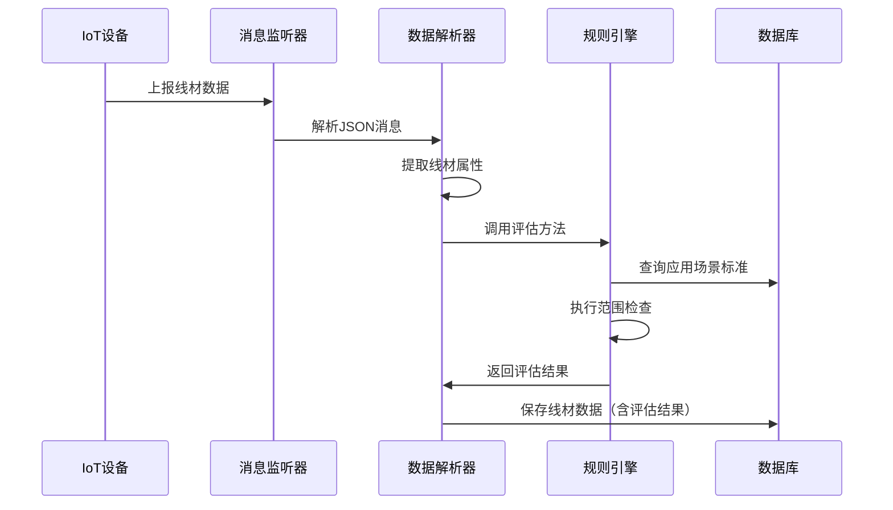
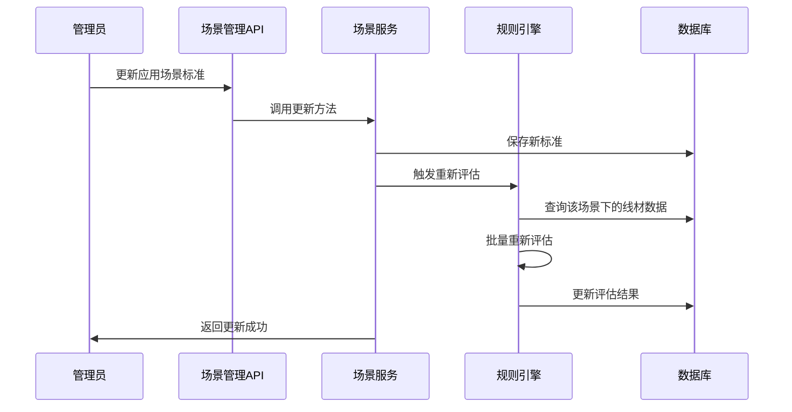

# 规则引擎使用指南

## 概述

规则引擎是金属微丝后端系统的核心质量控制模块，用于实时评估线材检测数据是否符合预设的应用场景标准。系统会根据应用场景中定义的各项指标范围，自动对IoT设备上报的线材数据进行质量评估。

## 功能特性

### 🔄 实时评估
- IoT设备上报线材数据时自动触发质量评估
- 根据批次号解析出的应用场景编号匹配对应标准
- 实时返回评估结果（合格/不合格/未评估）

### 📊 多指标检查
支持以下四个关键指标的范围检查：
- **直径 (DIR_s)**: 金属丝直径检测
- **电导率 (RES_s)**: 电阻/电导率测量
- **延展率 (EXT_s)**: 材料延展性测试
- **重量 (WEI_s)**: 重量测量

### 🔄 自动重新评估
- 应用场景标准更新时自动重新评估该场景下的所有历史数据
- 支持管理员手动触发批量重新评估
- 评估失败不影响数据存储和后续处理

### 📝 详细记录
- 记录具体的不合格指标
- 提供评估失败的详细原因
- 支持评估状态跟踪

## 数据库设计

### WireMaterial 实体扩展

```sql
-- 新增字段
ALTER TABLE wire_materials 
ADD COLUMN evaluation_result VARCHAR(10) DEFAULT 'UNKNOWN',
ADD COLUMN evaluation_message VARCHAR(500);
```

### 评估结果枚举
- `PASS`: 合格 - 所有指标均符合标准
- `FAIL`: 不合格 - 存在超出标准范围的指标
- `UNKNOWN`: 未评估 - 无法获取应用场景标准或评估过程异常

## API 接口

### 手动重新评估
```http
POST /api/scenario/{scenarioCode}/re-evaluate
```

**权限要求**: 管理员（roleId=1）

**路径参数**:
- `scenarioCode`: 应用场景编号（两位数字）

**响应示例**:
```json
{
    "success": true,
    "message": "应用场景 01 下的线材数据重新评估完成，共处理 150 条数据",
    "data": "应用场景 01 下的线材数据重新评估完成，共处理 150 条数据"
}
```

## 评估规则说明

### 批次号解析
系统从21位批次号中解析应用场景编号：
```
批次号格式：Cu0120250629010010001
位置说明：
- 3-4位：应用场景编号 (01)
- 13-14位：检测机器号 (01)
```

### 范围检查逻辑
对于每个检测指标，执行以下检查：

1. **获取标准范围**: 从应用场景配置中获取 `min` 和 `max` 值
2. **数值比较**: 检查实测值是否在 `[min, max]` 范围内
3. **空值处理**: 空值不参与评估（视为通过）
4. **结果记录**: 记录所有不合格的指标名称

### 示例评估过程

**应用场景01标准**:
```json
{
    "scenarioCode": "01",
    "scenarioName": "高精度铜丝",
    "wireType": "Cu",
    "diameterMin": 0.10,
    "diameterMax": 0.15,
    "conductivityMin": 95.0,
    "conductivityMax": 99.0,
    "extensibilityMin": 20.0,
    "extensibilityMax": 35.0,
    "weightMin": 1.0,
    "weightMax": 5.0
}
```

**线材检测数据**:
```json
{
    "batchNumber": "Cu0120250629010010001",
    "diameter": 0.12,      // ✅ 在范围内 [0.10, 0.15]
    "resistance": 96.5,    // ✅ 在范围内 [95.0, 99.0]
    "extensibility": 38.0, // ❌ 超出范围 [20.0, 35.0]
    "weight": 3.2          // ✅ 在范围内 [1.0, 5.0]
}
```

**评估结果**:
```json
{
    "evaluationResult": "FAIL",
    "evaluationMessage": "延展率超出标准范围"
}
```

## 业务流程

### 1. IoT数据接收评估流程


### 2. 应用场景更新重评流程


## 代码示例

### 自定义评估逻辑扩展
```java
@Service
public class CustomRuleEngineServiceImpl implements RuleEngineService {
    
    @Override
    public WireMaterial evaluateWireMaterial(WireMaterial wireMaterial) {
        // 基础范围检查
        WireMaterial evaluated = super.evaluateWireMaterial(wireMaterial);
        
        // 自定义业务规则
        if (wireMaterial.getScenarioCode().equals("01")) {
            // 高精度场景的特殊检查
            if (wireMaterial.getDiameter() != null 
                && wireMaterial.getWeight() != null) {
                
                // 直径-重量比例检查
                BigDecimal ratio = wireMaterial.getWeight()
                    .divide(wireMaterial.getDiameter(), 4, RoundingMode.HALF_UP);
                
                if (ratio.compareTo(new BigDecimal("20")) > 0) {
                    evaluated.setEvaluationResult(WireMaterial.EvaluationResult.FAIL);
                    evaluated.setEvaluationMessage(
                        evaluated.getEvaluationMessage() + "；直径重量比例异常"
                    );
                }
            }
        }
        
        return evaluated;
    }
}
```

### 批量查询评估结果
```java
// 查询不合格的线材数据
List<WireMaterial> failedMaterials = wireMaterialRepository.findAll(
    (root, query, cb) -> cb.equal(
        root.get("evaluationResult"), 
        WireMaterial.EvaluationResult.FAIL
    )
);

// 统计各场景的合格率
Map<String, Long> passRateByScenario = wireMaterialRepository.findAll()
    .stream()
    .filter(wm -> wm.getScenarioCode() != null)
    .collect(Collectors.groupingBy(
        WireMaterial::getScenarioCode,
        Collectors.counting()
    ));
```

## 配置说明

### 日志配置
规则引擎的详细日志可通过华为IoT配置控制：

```yaml
huawei:
  iot:
    message:
      enable-detailed-logging: true  # 启用详细评估日志
```

当启用详细日志时，系统会记录：
- 每次评估的详细过程
- 指标检查结果
- 评估失败的具体原因

### 性能调优
```yaml
spring:
  jpa:
    properties:
      hibernate:
        jdbc:
          batch_size: 50  # 批量重评时的批处理大小
        order_inserts: true
        order_updates: true
```

## 监控和运维

### 关键日志监控
```bash
# 监控评估失败的线材数据
grep "评估线材数据失败" application.log

# 监控重新评估任务
grep "重新评估.*完成" application.log

# 统计评估结果分布
grep "完成线材评估" application.log | grep -c "PASS"
grep "完成线材评估" application.log | grep -c "FAIL"
```

### 数据库监控查询
```sql
-- 查看评估结果统计
SELECT 
    evaluation_result,
    COUNT(*) as count,
    ROUND(COUNT(*) * 100.0 / SUM(COUNT(*)) OVER(), 2) as percentage
FROM wire_materials 
WHERE evaluation_result IS NOT NULL
GROUP BY evaluation_result;

-- 查看各场景的合格率
SELECT 
    scenario_code,
    COUNT(*) as total,
    SUM(CASE WHEN evaluation_result = 'PASS' THEN 1 ELSE 0 END) as pass_count,
    ROUND(
        SUM(CASE WHEN evaluation_result = 'PASS' THEN 1 ELSE 0 END) * 100.0 / COUNT(*), 
        2
    ) as pass_rate
FROM wire_materials 
WHERE scenario_code IS NOT NULL 
  AND evaluation_result IN ('PASS', 'FAIL')
GROUP BY scenario_code
ORDER BY pass_rate DESC;
```

## 故障排查

### 常见问题

1. **评估结果为UNKNOWN**
   - 检查应用场景是否存在
   - 验证批次号格式是否正确
   - 确认场景编号解析逻辑

2. **重新评估失败**
   - 检查数据库连接
   - 验证应用场景配置完整性
   - 查看错误日志获取详细信息

3. **评估性能问题**
   - 检查数据库索引
   - 调整批处理大小
   - 考虑异步处理大批量数据

### 调试技巧

启用DEBUG级别日志查看详细评估过程：
```yaml
logging:
  level:
    com.mmw.metal_micro_wire_backend.service.impl.RuleEngineServiceImpl: DEBUG
```

## 最佳实践

1. **标准配置**: 确保应用场景标准配置完整且合理
2. **数据质量**: 定期检查IoT数据的完整性和准确性
3. **性能监控**: 监控评估耗时，及时优化性能瓶颈
4. **结果跟踪**: 建立评估结果的统计和分析机制
5. **异常处理**: 完善异常情况的处理和恢复机制

---
